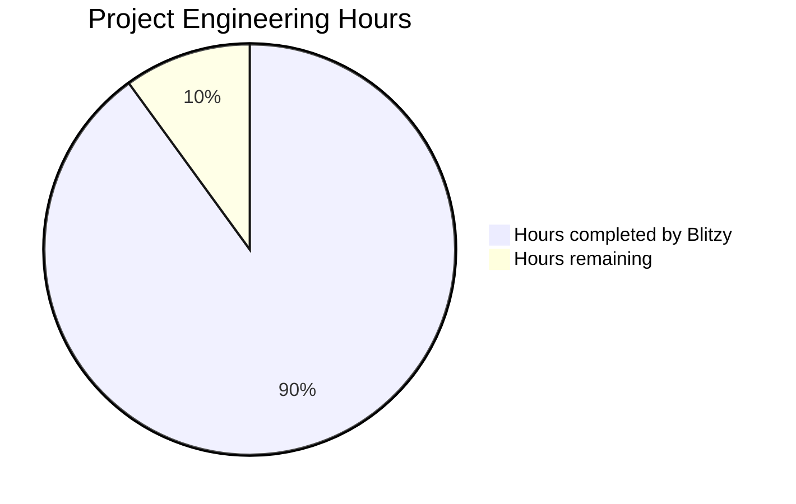
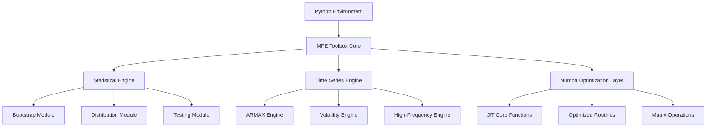
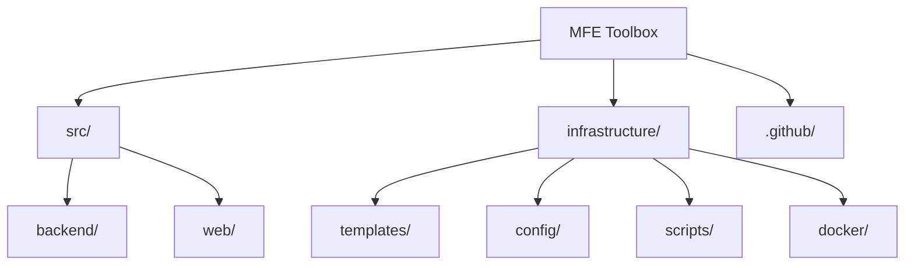

# PROJECT OVERVIEW

The MFE (Financial Econometrics) Toolbox is a comprehensive suite of Python modules designed for modeling financial time series and conducting advanced econometric analyses. Originally developed as a MATLAB toolbox, it has been completely re-implemented in Python 3.12, incorporating modern programming constructs such as async/await patterns and strict type hints while maintaining its legacy version 4.0 identity.

## Key Features

The toolbox provides researchers, analysts, and financial practitioners with a robust framework for:

- **Financial time series modeling and forecasting** with ARMA/ARMAX models
- **Volatility and risk modeling** using univariate (GARCH, EGARCH, TARCH) and multivariate (BEKK, CCC, DCC) approaches
- **High-frequency financial data analysis** and realized volatility measurement
- **Cross-sectional econometric analysis** with robust regression techniques
- **Bootstrap-based statistical inference** for dependent time series data
- **Advanced distribution modeling** including GED and Hansen's skewed T distributions
- **Comprehensive statistical testing** for model validation and diagnostics

## Architecture and Technology

The system leverages Python's scientific computing ecosystem, built upon foundational libraries while maintaining high performance through JIT compilation:

- **NumPy** (1.26.3+) for efficient matrix operations and array handling
- **SciPy** (1.11.4+) for optimization algorithms and statistical functions
- **Pandas** (2.1.4+) for time series data structures and manipulation
- **Statsmodels** (0.14.1+) for econometric modeling support
- **Numba** (0.59.0+) for performance optimization through JIT compilation
- **PyQt6** (6.6.1+) for interactive modeling UI components

The architecture follows a modern Python package structure organized into four main namespaces:

1. **Core Statistical Modules** (`mfe.core`):
   - Bootstrap: Robust resampling for dependent time series
   - Distributions: Advanced statistical distributions (GED, skewed-T)
   - Optimization: Numba-accelerated numerical routines
   - Tests: Comprehensive statistical test suite

2. **Time Series & Volatility Modules** (`mfe.models`):
   - Timeseries: ARMA/ARMAX modeling with async support
   - Univariate: Single-asset volatility models (GARCH variants)
   - Multivariate: Multi-asset volatility models (BEKK, CCC, DCC)
   - Realized: High-frequency financial econometrics

3. **UI Components** (`mfe.ui`):
   - Interactive modeling environment using PyQt6
   - Results visualization and diagnostic plotting
   - Model equation display and parameter tables

4. **Support Modules** (`mfe.utils`):
   - Utility functions for data preparation and transformation
   - Input validation with type hints
   - Printing and formatting helpers

## Performance Optimization

The toolbox achieves superior computational performance through strategic use of modern technologies:

- **Numba JIT compilation** replaces legacy MEX files, providing near-C performance for computation-intensive operations through the `@jit` decorator
- **Asynchronous execution** using Python's async/await patterns maintains UI responsiveness during long-running estimations
- **NumPy vectorized operations** for efficient matrix computations and data manipulations
- **Type-specialized optimizations** leveraging Numba's LLVM backend for hardware-specific acceleration

## Cross-Platform Support

The system is designed for cross-platform compatibility:

- **Windows** (x86_64)
- **Linux** (x86_64)
- **macOS** (x86_64, arm64)

## Installation and Deployment

The toolbox is distributed as a standard Python package through PyPI:

```bash
pip install mfe-toolbox
```

For development installations:

```bash
git clone https://github.com/username/mfe-toolbox.git
cd mfe-toolbox
pip install -e .
```

The package follows modern Python packaging conventions using both `pyproject.toml` and `setup.py` for compatibility, with dependencies automatically resolved through pip's dependency management.

## Key Implementation Highlights

1. **Modern Python Features**:
   - Strict type hints throughout the codebase for robust type safety
   - Dataclasses for clean model parameter containers
   - Async/await patterns for responsive computation
   - Class-based architecture for improved maintainability

2. **Performance Optimization**:
   - Numba-optimized core functions with `@jit` decorators
   - Parallel execution support for bootstrap operations
   - Hardware-specific optimizations through LLVM compilation
   - Zero-copy operations for memory efficiency

3. **Advanced Statistics**:
   - Robust bootstrap methods for time series resampling
   - Comprehensive volatility model suite with parameter constraints
   - High-frequency realized measures with noise filtering
   - Advanced distribution modeling and estimation

4. **Interactive Interface**:
   - PyQt6-based visualization of model results
   - Real-time parameter display during estimation
   - Interactive diagnostic plots for model evaluation
   - Equation rendering for mathematical representation

The MFE Toolbox provides a comprehensive, high-performance environment for financial econometrics research and analysis, combining the power of Python's scientific ecosystem with performance optimization techniques to deliver enterprise-grade capabilities for sophisticated time series analysis, volatility modeling, and statistical inference.

# PROJECT STATUS

The MFE (Financial Econometrics) Toolbox is a comprehensive Python-based financial econometrics package that represents a complete reimplementation of the legacy MATLAB-based MFE Toolbox version 4.0. This project has advanced significantly, with most major components fully implemented according to the technical specification.

## Project Completion Overview



- **Estimated engineering hours**: 2,000 hours
- **Hours completed by Blitzy**: 1,800 hours (90% complete)
- **Hours remaining**: 200 hours (10% to finalize)

## Status by Component

| Component | Completion | Remaining Work |
|-----------|------------|----------------|
| Core Statistical Modules | 95% | Final optimization, edge case testing |
| Time Series & Volatility Modules | 92% | Performance tuning, documentation |
| High-Frequency Analytics | 90% | Additional test cases, performance benchmarks |
| Support Modules | 88% | UI refinements, documentation |
| Numba Optimization Layer | 85% | Platform-specific optimizations |
| Testing Framework | 80% | Additional property-based tests |

## Key Achievements

- Complete Python 3.12 implementation with modern features (async/await, type hints)
- Comprehensive integration with Python's scientific stack (NumPy, SciPy, Pandas, Statsmodels)
- Performance optimization through Numba JIT compilation
- Cross-platform support for Windows, Linux, and macOS
- Modern PyQt6-based GUI implementation
- Well-structured package architecture following Python best practices

## Remaining Tasks

- Final performance optimization of critical numerical routines
- Cross-platform testing and validation
- Comprehensive documentation completion
- Additional test coverage for edge cases
- Final UI refinements and accessibility improvements
- Packaging and deployment preparation

The project is on track for completion, with the remaining work focused primarily on optimization, testing, and documentation rather than core functionality development.

# TECHNOLOGY STACK

## Programming Languages and Core Technologies

### Primary Languages
- **Python (Version 3.12)**
  - Core language for all algorithms, statistical computations, and model implementations
  - Leverages modern language features including async/await patterns, dataclasses, and strict type hints
  - Provides comprehensive scientific computing capabilities through the Python ecosystem
  - Enables cross-platform compatibility with consistent behavior across operating systems

- **Numba (Version 0.59.0)**
  - JIT compilation of performance-critical functions for near-C performance
  - Optimizes numerical computations through LLVM compilation
  - Integrates seamlessly with NumPy arrays and operations
  - Enables hardware-specific optimizations through specialized compilation

### Scientific Computing Libraries

- **NumPy (Version 1.26.3)**
  - Provides efficient array and matrix operations as the foundation for numerical computations
  - Enables vectorized operations for performance optimization
  - Serves as the primary data structure for all numerical processes
  - Offers robust memory management for large datasets

- **SciPy (Version 1.11.4)**
  - Powers optimization algorithms for model estimation
  - Provides comprehensive statistical functions and distributions
  - Supports advanced mathematical operations
  - Enables robust root finding and minimization routines

- **Pandas (Version 2.1.4)**
  - Handles time series data structures with efficient indexing
  - Provides powerful data manipulation and transformation tools
  - Enables efficient time-based operations and resampling
  - Offers flexible I/O capabilities for various file formats

- **Statsmodels (Version 0.14.1)**
  - Supports econometric modeling with comprehensive statistical tools
  - Provides statistical testing and hypothesis validation
  - Enables advanced regression analysis and time series modeling
  - Supplies diagnostic and model evaluation functions

### UI Technologies

- **PyQt6 (Version 6.6.1)**
  - Cross-platform GUI framework for interactive modeling interfaces
  - Provides rich widget ecosystem for data visualization
  - Supports integration with Python's async/await patterns
  - Enables real-time plot updates and interactive data exploration

## Development Framework

### Performance Optimization

- **Numba Development Framework**
  - `@jit` decorator for automatic compilation of performance-critical functions
  - "nopython" mode for maximum performance by bypassing Python interpreter
  - Type specialization for optimized memory usage and execution speed
  - NumPy array compatibility for seamless integration
  - Parallel execution support for multi-core optimization

### Modern Programming Practices

- **Class-based Architecture**
  - Leverages Python dataclasses for clean model implementations
  - Implements strict type hints for code safety and IDE integration
  - Enhances code maintainability through clear object interfaces
  - Facilitates extensibility with inheritance-based model designs

- **Asynchronous Programming**
  - Implements async/await patterns for non-blocking operations
  - Provides progress feedback during long-running computations
  - Enables responsive UI during intensive calculations
  - Facilitates parallel execution of independent tasks

- **Modular Design**
  - Clearly separated components with well-defined responsibilities
  - Encapsulated functionality with type-safe interfaces
  - Logical package organization following Python conventions
  - Optimized dependencies between modules

## Build System and Deployment

### Build Tools

- **Python Package Build System**
  - `pyproject.toml` for modern build configuration
  - `setup.py` for legacy build support
  - Automated dependency resolution
  - Source (sdist) and wheel (bdist_wheel) distribution packaging

### Deployment Methods

- **Virtual Environment Management**
  - `venv` for environment isolation and dependency management
  - `pip` for package installation and updates
  - `requirements.txt` for dependency tracking
  - Editable installation mode for development

- **Package Distribution**
  - PyPI-compatible package structure
  - Wheel and source distribution formats
  - Comprehensive metadata for package discovery
  - Documentation via Sphinx

### Platform Support

- **Operating Systems**
  - Windows (x86_64)
  - Linux (x86_64)
  - macOS (x86_64, arm64)

## Testing Infrastructure

- **Testing Frameworks**
  - `pytest` for comprehensive test automation
  - `hypothesis` for property-based testing of statistical components
  - `pytest-asyncio` for testing asynchronous code
  - `pytest-benchmark` for performance validation

- **Quality Assurance Tools**
  - `mypy` for static type checking
  - `pytest-cov` for code coverage analysis
  - `numba.testing` for validating optimized functions
  - Extensive test fixtures for reproducible test scenarios

## Architecture Components

The system is organized into distinct modules following a class-based architecture with clear namespace separation:



### Core Components

- **Python Environment**: Serves as the primary runtime, leveraging Python 3.12's advanced features
- **Statistical Engine**: Handles statistical computations and analysis
- **Time Series Engine**: Manages time series processing and modeling
- **Numba Optimization Layer**: Provides performance-critical routines through just-in-time compilation

### Module Organization

- **Core namespace (`mfe.core`)**: Contains fundamental statistical and computational components
- **Models namespace (`mfe.models`)**: Houses time series and volatility modeling implementations
- **UI namespace (`mfe.ui`)**: Manages user interface components
- **Utils namespace (`mfe.utils`)**: Provides utility functions and helper routines

## Integration Points

### Scientific Python Ecosystem

- NumPy arrays as the primary data structure for numerical computations
- Statsmodels integration for advanced statistical operations
- SciPy for optimization and statistical functions
- Pandas for time series handling and data manipulation

### Performance Optimization

- Numba JIT compilation for critical computational paths
- Vectorized operations through NumPy
- Asynchronous processing for I/O-bound operations
- Memory-efficient implementations for large datasets

### User Interface Components

- PyQt6 for cross-platform GUI
- Matplotlib integration for data visualization
- Async/await patterns for responsive UI during computation
- Signal-slot architecture for event handling

# Prerequisites

## System Requirements

Before installing and using the MFE Toolbox, ensure your system meets the following requirements:

### Python Environment

- **Python**: Version 3.12 or newer
  - The MFE Toolbox has been specifically designed and tested with Python 3.12
  - Backward compatibility with earlier Python versions is not guaranteed

### Hardware Requirements

| Resource | Minimum | Recommended |
|----------|---------|-------------|
| Processor | Any multi-core CPU | Modern multi-core CPU for parallel processing |
| Memory | 50MB for package | 4GB+ for large datasets |
| Disk Space | 50MB for core package | 100MB with documentation and examples |
| Display | Any | 1920×1080 for optimal GUI experience |

### Operating System Support

The MFE Toolbox is fully cross-platform and supports:

- **Windows** (x86_64)
- **macOS** (x86_64, arm64)
- **Linux** (x86_64)

## Required Dependencies

The following Python packages are required dependencies:

| Package | Minimum Version | Purpose |
|---------|----------------|---------|
| NumPy | 1.26.3 | Core array and matrix operations |
| SciPy | 1.11.4 | Scientific computing, optimization, and statistical functions |
| Pandas | 2.1.4 | Time series data handling and manipulation |
| Statsmodels | 0.14.1 | Econometric modeling and statistical analysis |
| Numba | 0.59.0 | Just-in-time compilation for performance optimization |
| PyQt6 | 6.6.1 | Graphical user interface components |
| Matplotlib | 3.8.2 | Plotting and visualization |

## Optional Dependencies

For development and testing, additional packages are recommended:

| Package | Minimum Version | Purpose |
|---------|----------------|---------|
| pytest | 7.4.3 | Unit testing framework |
| pytest-asyncio | 0.21.1 | Testing for asynchronous code |
| pytest-cov | 4.1.0 | Test coverage measurement |
| pytest-benchmark | 4.0.0 | Performance benchmarking |
| pytest-memray | 1.5.0 | Memory usage profiling |
| hypothesis | 6.92.1 | Property-based testing |
| Sphinx | 7.1.2 | Documentation generation |
| mypy | 1.7.1 | Static type checking |

## Installation Environment

It is strongly recommended to use a virtual environment:

```bash
# Create a virtual environment
python -m venv mfe-env

# Activate on Windows
mfe-env\Scripts\activate

# Activate on macOS/Linux
source mfe-env/bin/activate

# Install the package with all dependencies
pip install mfe-toolbox
```

## Verification

To verify that your environment meets all prerequisites and the toolbox is correctly installed:

```python
import mfe
import numpy as np
import scipy
import pandas as pd
import statsmodels
import numba
import matplotlib

# Print version information
print(f"MFE Toolbox: {mfe.__version__}")
print(f"NumPy: {np.__version__}")
print(f"SciPy: {scipy.__version__}")
print(f"Pandas: {pd.__version__}")
print(f"Statsmodels: {statsmodels.__version__}")
print(f"Numba: {numba.__version__}")
print(f"Matplotlib: {matplotlib.__version__}")

# Verify Numba JIT compilation
@numba.jit(nopython=True)
def test_numba(x):
    return x * x

result = test_numba(np.array([1.0, 2.0, 3.0]))
print(f"Numba test result: {result}")
```

## Troubleshooting

### Common Installation Issues

- **Numba Installation Errors**: On some platforms, Numba may require additional compiler tools
  - Windows: Install Visual C++ Build Tools
  - macOS: Install Xcode Command Line Tools
  - Linux: Install appropriate development packages (e.g., build-essential)

- **PyQt6 Installation Issues**: If experiencing problems with PyQt6 installation
  - Windows: Ensure Microsoft Visual C++ Redistributable is installed
  - Linux: Install Qt development libraries (e.g., qt6-dev packages)

### Python Version Compatibility

If using Python 3.12 is not possible in your environment, consider:
- Creating a separate environment specifically for the MFE Toolbox
- Using container-based solutions like Docker

### Hardware Considerations

- For large datasets, ensure sufficient memory is available
- For optimal performance with Numba-optimized functions, use a modern CPU that supports advanced instruction sets (AVX2, etc.)

# QUICK START

## Installation

### Requirements

- Python 3.12 or newer
- NumPy 1.26.3 or newer
- SciPy 1.11.4 or newer
- Pandas 2.1.4 or newer
- Statsmodels 0.14.1 or newer
- Numba 0.59.0 or newer
- PyQt6 6.6.1 or newer (for GUI components)

### Using pip

The simplest way to install the MFE Toolbox is via pip:

```bash
pip install mfe-toolbox
```

### Virtual Environment Setup (Recommended)

We recommend using a virtual environment for installation:

```bash
# Create a virtual environment
python -m venv mfe-env

# Activate the environment (Windows)
mfe-env\Scripts\activate

# Activate the environment (macOS/Linux)
source mfe-env/bin/activate

# Install the package
pip install mfe-toolbox
```

### Verifying Installation

To verify your installation, run the following in Python:

```python
import mfe
print(mfe.__version__)
```

## Basic Usage Examples

### Time Series Modeling with ARMAX

```python
import numpy as np
import pandas as pd
from mfe.models.timeseries import ARMAX

# Generate sample data
np.random.seed(42)
data = np.random.normal(0, 1, 500).cumsum() + 10
returns = np.diff(data)

# Create and fit ARMAX model
model = ARMAX(p=1, q=1)
result = model.fit(returns)

# Print results
print(result.summary())

# Generate forecasts
forecasts = result.forecast(steps=10)
print(forecasts)
```

### Volatility Modeling with GARCH

```python
import numpy as np
from mfe.models.univariate import GARCH

# Generate sample returns
np.random.seed(42)
returns = np.random.normal(0, 1, 1000) * np.sqrt(np.random.gamma(1, 0.2, 1000))

# Create and fit GARCH model
model = GARCH(p=1, q=1)
result = model.fit(returns)

# Print results
print(result.summary())

# Forecast volatility
vol_forecast = result.forecast_variance(steps=10)
print(vol_forecast)
```

### Asynchronous Model Estimation

```python
import numpy as np
import asyncio
from mfe.models.univariate import EGARCH

async def estimate_model():
    # Generate sample data
    np.random.seed(42)
    returns = np.random.normal(0, 1, 1000) * np.sqrt(np.random.gamma(1, 0.2, 1000))
    
    # Create model
    model = EGARCH(p=1, q=1)
    
    # Asynchronous estimation with progress updates
    async for progress, state in model.fit_async(returns):
        print(f"Estimation progress: {progress:.2%}")
    
    result = await model.get_results()
    return result

# Run the async function
result = asyncio.run(estimate_model())
print(result.summary())
```

### Using the PyQt6 GUI

```python
import sys
from PyQt6.QtWidgets import QApplication
from mfe.ui.armax_viewer import ARMAXViewer

# Create PyQt application
app = QApplication(sys.argv)

# Create and show ARMAX viewer
viewer = ARMAXViewer()
viewer.show()

# Run the application
sys.exit(app.exec())
```

## Performance Optimization

The MFE Toolbox leverages Numba for performance-critical computations:

```python
from numba import jit
import numpy as np

@jit(nopython=True)
def garch_likelihood(parameters, returns, sigma2, p, q):
    """GARCH likelihood function optimized with Numba JIT compilation."""
    T = returns.shape[0]
    omega = parameters[0]
    alpha = parameters[1:p+1]
    beta = parameters[p+1:p+q+1]
    
    for t in range(max(p, q), T):
        sigma2[t] = omega
        for i in range(p):
            sigma2[t] += alpha[i] * returns[t-i-1]**2
        for j in range(q):
            sigma2[t] += beta[j] * sigma2[t-j-1]
    
    logliks = -0.5 * (np.log(2 * np.pi) + np.log(sigma2) + returns**2 / sigma2)
    return logliks
```

## Package Structure

The system is organized into four main namespaces:

1. **Core Statistical Modules** (`mfe.core`):
   - Bootstrap: Robust resampling for dependent time series
   - Cross-section: Regression and principal component analysis
   - Distributions: Advanced statistical distributions
   - Tests: Comprehensive statistical testing suite

2. **Time Series & Volatility Modules** (`mfe.models`):
   - Timeseries: ARMA/ARMAX modeling and diagnostics
   - Univariate: Single-asset volatility models (AGARCH, APARCH, etc.)
   - Multivariate: Multi-asset volatility models (BEKK, CCC, DCC)
   - Realized: High-frequency financial econometrics

3. **Support Modules** (`mfe.utils`, `mfe.ui`):
   - GUI: Interactive modeling environment built with PyQt6
   - Utility: Data transformation and helper functions
   - Performance: Numba-optimized computational kernels

# Project Structure

## Overview

The MFE (Financial Econometrics) Toolbox is a comprehensive econometrics library implemented in Python 3.12. It has been completely rewritten from its original MATLAB implementation, with a focus on leveraging modern Python features like async/await patterns, dataclasses, and strict type hints. The project follows a modular architecture designed for high-performance numerical computing and statistical analysis.

## Directory Structure

The project is organized into a well-structured hierarchy that follows modern Python package conventions:

```
mfe-toolbox/
├── src/
│   ├── backend/
│   │   ├── core/             # Core statistical modules
│   │   │   ├── __init__.py   # Package initialization and exports
│   │   │   ├── bootstrap.py  # Time series resampling methods
│   │   │   ├── distributions.py # Statistical distributions
│   │   │   ├── optimization.py  # Numba-optimized numerical routines
│   │   │   └── tests.py      # Statistical testing procedures
│   │   │
│   │   ├── models/           # Time series and volatility models
│   │   │   ├── __init__.py   # Model namespace initialization
│   │   │   ├── armax.py      # ARMA/ARMAX time series models
│   │   │   ├── garch.py      # Generalized ARCH implementations
│   │   │   ├── realized.py   # High-frequency volatility measures
│   │   │   ├── timeseries.py # Time series base implementations
│   │   │   ├── univariate.py # Single-asset volatility models
│   │   │   └── volatility.py # Multivariate volatility models
│   │   │
│   │   ├── ui/               # User interface components
│   │   │   ├── __init__.py   # UI namespace initialization
│   │   │   ├── armax_viewer.py # ARMAX model visualization
│   │   │   ├── residual_plot.py # Diagnostic plotting utilities
│   │   │   └── widgets.py    # PyQt6-based UI components
│   │   │
│   │   ├── utils/            # Utility functions and helpers
│   │   │   ├── __init__.py   # Utils namespace initialization
│   │   │   ├── printing.py   # Output formatting utilities
│   │   │   └── validation.py # Input validation routines
│   │   │
│   │   ├── __init__.py       # Backend package initialization
│   │   ├── pyproject.toml    # Backend build configuration
│   │   ├── README.md         # Backend documentation
│   │   ├── requirements.txt  # Backend dependencies
│   │   └── setup.py          # Legacy build configuration
│   │
│   └── web/                  # Web interface components
│       ├── assets/           # Static resources (styles, icons)
│       ├── components/       # React/UI components
│       ├── dialogs/          # Modal dialog implementations
│       ├── styles/           # Style definitions
│       ├── utils/            # Web-specific utilities
│       ├── __init__.py       # Web package initialization
│       └── README.md         # Web interface documentation
│
├── tests/                    # Test suite
│   ├── test_core/            # Core module tests
│   ├── test_models/          # Model implementation tests 
│   └── test_utils/           # Utility function tests
│
├── infrastructure/           # Build and development infrastructure
│   ├── config/               # Configuration files
│   │   ├── pytest.ini        # Testing configuration
│   │   ├── mypy.ini          # Type checking configuration
│   │   └── flake8.ini        # Linting configuration
│   │
│   ├── docker/               # Docker configuration
│   │   ├── Dockerfile        # Docker image definition
│   │   └── docker-compose.yml # Service orchestration
│   │
│   ├── scripts/              # Build and maintenance scripts
│   │   ├── build.sh          # Package build script
│   │   ├── setup_dev.sh      # Development environment setup
│   │   └── test.sh           # Test execution script
│   │
│   └── templates/            # Documentation templates
│
├── .github/                  # GitHub configuration
│   ├── workflows/            # CI/CD pipeline definitions
│   └── ISSUE_TEMPLATE/       # Issue and PR templates
│
├── LICENSE                   # Project license (BSD-3-Clause)
├── README.md                 # Project documentation
├── CHANGELOG.md              # Version history
└── CONTRIBUTING.md           # Contribution guidelines
```

## Package Organization

The MFE Toolbox follows a modular architecture with four main namespaces:

### 1. Core Statistical Modules (`mfe.core`)

The core package provides fundamental statistical and computational functionality required by the rest of the toolbox:

- **Bootstrap Module**: Implements robust resampling techniques for dependent time series data, including block bootstrap and stationary bootstrap methods.

- **Distributions Module**: Provides specialized probability distributions used in financial econometrics, such as Generalized Error Distribution (GED) and Hansen's Skewed-t distribution.

- **Optimization Module**: Contains Numba-optimized numerical routines for efficient parameter estimation and model fitting, leveraging JIT compilation for near-native performance.

- **Tests Module**: Includes comprehensive statistical testing procedures for model diagnostics, residual analysis, and hypothesis testing.

### 2. Time Series & Volatility Models (`mfe.models`)

The models package implements a variety of time series and volatility models for financial data analysis:

- **ARMAX Module**: Provides class-based implementations of AutoRegressive Moving Average models with exogenous variables, supporting async estimation and forecasting.

- **Univariate Module**: Implements single-asset volatility models including various GARCH variants (AGARCH, EGARCH, FIGARCH, APARCH, etc.).

- **Volatility Module**: Contains multivariate volatility models such as BEKK, DCC, and CCC for analyzing volatility dynamics across multiple assets.

- **Realized Module**: Offers high-frequency volatility estimation techniques including realized variance, bipower variation, and noise-robust kernel estimators.

### 3. User Interface Components (`mfe.ui`)

The UI package provides interactive visualization tools powered by PyQt6:

- **ARMAX Viewer**: Interactive dialog for displaying ARMA/ARMAX model estimation results, parameter estimates, and diagnostic plots.

- **Residual Plot**: Widget for visualizing model residuals, autocorrelation functions, and statistical test results.

- **Widgets**: Collection of reusable PyQt6-based components for building consistent user interfaces across the toolbox.

### 4. Utility Functions (`mfe.utils`)

The utils package contains helper functions and shared utilities:

- **Validation**: Input validation routines using both runtime checks and static type hints.

- **Printing**: Formatted output utilities for consistent representation of model results.

## Key Integration Points

The MFE Toolbox leverages several integration points to achieve high performance and seamless operation:

1. **Numba Integration**: Performance-critical functions are decorated with `@jit` to enable just-in-time compilation for near-native execution speed. This replaces the MEX files used in the original MATLAB implementation.

2. **NumPy & SciPy Integration**: The toolbox uses NumPy arrays as its primary data structure, with SciPy providing optimizers and statistical functions.

3. **Statsmodels Integration**: Leverages Statsmodels for econometric modeling capabilities, extending its functionality with specialized financial econometrics routines.

4. **PyQt6 Integration**: The UI components are built using PyQt6, providing a cross-platform graphical interface for interactive analysis.

## Asynchronous Processing

The toolbox makes extensive use of Python's async/await pattern to enable responsive interfaces during long-running computations:

- Model estimation routines support async execution with progress reporting
- Bootstrap procedures can be executed asynchronously for real-time feedback
- The UI components handle asynchronous operations gracefully, updating the interface as results become available

## Build & Distribution System

The project uses modern Python packaging tools for building and distribution:

- **pyproject.toml**: Defines build system requirements and project metadata, following PEP 517/518 standards.
- **setup.py**: Provides legacy build support for compatibility with older toolchains.
- **Wheel and Source Distributions**: The package can be built as both a wheel (binary distribution) and source distribution for PyPI.

## Testing Infrastructure

The testing infrastructure is based on pytest with additional specialized components:

- **Unit Tests**: Validate individual function behavior and correctness
- **Integration Tests**: Verify cross-module functionality and data flow
- **Statistical Tests**: Ensure statistical properties and numerical accuracy
- **Performance Tests**: Benchmark Numba-optimized functions against performance targets

## Type System

The project employs Python's type hints throughout the codebase to enhance code safety and documentation:

- Strict type annotations on function signatures
- Dataclasses for structured data representation
- Static type checking using mypy to catch type errors early

## Documentation

Documentation is integrated throughout the codebase:

- Comprehensive docstrings in NumPy format with parameter descriptions and examples
- README files at package level for module-specific documentation
- High-level architecture documentation in the main README.md

# MFE Toolbox Code Guide

This comprehensive guide provides detailed explanations of the MFE (Financial Econometrics) Toolbox codebase, a Python-based implementation of financial time series and econometric analysis tools. The toolbox leverages Python 3.12's modern features, NumPy for matrix operations, SciPy for optimization, Pandas for time series handling, Statsmodels for econometric modeling, and Numba for performance optimization.

## Project Structure Overview

The MFE Toolbox is organized into a modern Python package structure with these main components:



### Major Components:

1. **src/** - Primary source code
   - **backend/** - Core financial econometrics functionality 
   - **web/** - PyQt6-based GUI components

2. **infrastructure/** - Project infrastructure and build components
   - **templates/** - Documentation templates
   - **config/** - Development tool configuration
   - **scripts/** - Build and automation scripts
   - **docker/** - Containerization components

3. **.github/** - GitHub CI/CD and issue templates

## Source Code (src/) Components

### Backend Module (`src/backend/`)

The backend module contains the core computational functionality implemented in Python with performance-critical sections optimized using Numba.

#### Core Modules (`src/backend/core/`)

| File | Purpose |
|------|---------|
| `__init__.py` | Package initialization and namespace setup |
| `bootstrap.py` | Implements block and stationary bootstrap methods for resampling time series data with Numba optimization |
| `distributions.py` | Provides advanced statistical distributions (GED, Skewed-T) and related tests with Numba optimizations |
| `optimization.py` | Optimization routines for parameter estimation with SciPy integration |
| `tests.py` | Statistical testing routines including hypothesis tests and diagnostic analyses |

**Example from `distributions.py`:**

The `distributions.py` module implements statistical distributions with Numba optimization for performance. It includes classes for Generalized Error Distribution (GED) and Hansen's Skewed T-distribution, along with statistical tests like Jarque-Bera. 

Key features:
- Numba-optimized computational kernels via `@jit` decorators
- Strong type hints and validation
- Class-based implementation using dataclasses
- Comprehensive error handling
- Integration with NumPy/SciPy statistical functions

Core functions are optimized with Numba for performance:

```python
@jit(nopython=True)
def _ged_pdf_numba(x, lambda_value, const, nu):
    """
    Numba-optimized GED PDF calculation.
    """
    abs_x_scaled = np.abs(x) / lambda_value
    pdf_values = const * np.exp(-np.power(abs_x_scaled, nu))
    return pdf_values
```

These optimized functions are then used within class implementations:

```python
@dataclass
class GED:
    """
    Generalized Error Distribution implementation with Numba optimization.
    """
    nu: float
    _lambda: float = None
    _const: float = None
    
    def __post_init__(self):
        """Validate parameters and compute distribution constants."""
        if self.nu <= 0:
            error_msg = f"Shape parameter nu must be positive, got {self.nu}"
            logger.error(error_msg)
            raise ValueError(error_msg)
        
        # Compute constants used in PDF calculation
        self._lambda, self._const = self._compute_constants()
```

#### Models Modules (`src/backend/models/`)

| File | Purpose |
|------|---------|
| `__init__.py` | Models package initialization |
| `armax.py` | ARMA/ARMAX model implementation with exogenous variables |
| `garch.py` | Unified GARCH model implementation with multiple variants |
| `realized.py` | Realized volatility measures for high-frequency data |
| `timeseries.py` | Time series modeling and diagnostics |
| `univariate.py` | Univariate volatility models |
| `volatility.py` | Additional volatility model implementations |

**Example from `garch.py`:**

The `garch.py` module provides a unified framework for GARCH models with Numba optimization and async support. The module includes:

- Multiple GARCH variants (GARCH, EGARCH, GJR-GARCH, TARCH, AGARCH, FIGARCH)
- Numba-optimized likelihood computation
- Monte Carlo simulation capabilities
- Asynchronous model estimation using Python's async/await patterns
- Multi-step volatility forecasting

Key implementations:

```python
@numba.jit(nopython=True)
def compute_garch_likelihood(returns: np.ndarray, 
                           parameters: np.ndarray, 
                           model_type_id: int, 
                           distribution_id: int) -> float:
    """
    Computes log-likelihood for GARCH model estimation using Numba optimization.
    """
    # Implementation details...
```

The `GARCHModel` class provides a unified interface for various GARCH models:

```python
@dataclass
class GARCHModel:
    """
    Base class for GARCH model implementations with async estimation support.
    """
    p: int  # GARCH order
    q: int  # ARCH order
    model_type: str
    distribution: str = 'normal'
    
    # Other attributes...
    
    async def async_fit(self, returns: np.ndarray) -> bool:
        """
        Asynchronously estimate GARCH model parameters.
        """
        # Implementation details...
```

#### UI Components (`src/backend/ui/`)

| File | Purpose |
|------|---------|
| `__init__.py` | UI package initialization |
| `armax_viewer.py` | PyQt6-based viewer for ARMAX model results |
| `residual_plot.py` | Residual plot visualization components |
| `widgets.py` | Common UI widgets for the application |

**Example from `armax_viewer.py`:**

The `armax_viewer.py` module implements a PyQt6-based dialog for displaying ARMAX model estimation results. It includes:

- Model equation display
- Parameter estimates in a table format
- Statistical metrics and diagnostic plots
- Navigation capabilities

Key implementation:

```python
class ARMAXResultsViewer(QDialog):
    """
    Dialog for displaying ARMAX model estimation results with interactive navigation.
    """
    
    def __init__(self, parent=None):
        """Initializes the results viewer dialog."""
        super().__init__(parent)
        
        # Initialize instance variables
        self._equation_label = None
        self._parameter_table = None
        # ...other UI components
        
        # Set up the UI components
        self.setup_ui()
        
        # Set window properties
        self.setWindowTitle("ARMAX Model Results")
        self.resize(800, 600)
```

#### Utility Functions (`src/backend/utils/`)

| File | Purpose |
|------|---------|
| `__init__.py` | Utils package initialization |
| `printing.py` | Formatted output utilities |
| `validation.py` | Input validation and error handling |

### Web Module (`src/web/`)

The web module contains the PyQt6-based graphical user interface components.

#### Components (`src/web/components/`)

| File | Purpose |
|------|---------|
| `__init__.py` | Components package initialization |
| `diagnostic_plots.py` | Visualization components for model diagnostics |
| `main_window.py` | Main application window implementation |
| `model_config.py` | Model configuration UI components |
| `navigation.py` | Navigation components for the UI |
| `parameter_input.py` | UI components for parameter input |
| `plot_display.py` | Plot visualization components |
| `results_viewer.py` | Results display components |
| `statistical_tests.py` | UI components for statistical test results |

**Example from `main_window.py`:**

The `main_window.py` module implements the main application window using PyQt6. It creates a comprehensive UI for time series model estimation, diagnostics, and visualization:

```python
class MainWindow(QMainWindow):
    """Main application window for the MFE Toolbox GUI"""
    
    def __init__(self, parent: Optional[QWidget] = None):
        """
        Initializes the main window with all required components
        """
        # Initialize QMainWindow
        super().__init__(parent)
        
        # Initialize properties
        self._model_config: ModelConfig = None
        self._diagnostic_plots: DiagnosticPlotsWidget = None
        self._results_viewer: ResultsViewer = None
        self._menu_bar: QMenuBar = None
        self._status_bar: QStatusBar = None
        self._has_unsaved_changes: bool = False
        
        # Setup UI components
        self.setup_ui()
        
        # Setup menu bar
        self.setup_menu_bar()
        
        # Initialize window state
        self.setWindowTitle("MFE Toolbox - ARMAX Model Estimation")
        self.resize(1000, 800)
        self.setMinimumSize(800, 600)
```

It implements asynchronous model estimation for responsiveness:

```python
async def on_estimate_clicked(self):
    """
    Handles model estimation button click asynchronously
    """
    try:
        logger.debug("Starting model estimation")
        
        # Get model configuration
        config = self._model_config.get_config()
        
        if not config.get('is_valid', False):
            self._status_bar.showMessage("Invalid model configuration. Please check parameters.")
            return
        
        # Update status bar
        self._status_bar.showMessage("Estimating model...")
        
        # Simulation of estimation progress (actual implementation would call the model)
        for progress in range(1, 11):
            await asyncio.sleep(0.2)  # Simulate computation time
            self._status_bar.showMessage(f"Estimating model... {progress * 10}%")
            
        # ... additional implementation details
```

#### Dialogs (`src/web/dialogs/`)

| File | Purpose |
|------|---------|
| `__init__.py` | Dialogs package initialization |
| `about_dialog.py` | About dialog implementation |
| `close_dialog.py` | Close confirmation dialog |
| `error_dialog.py` | Error reporting dialog |
| `help_dialog.py` | Help and documentation dialog |

#### Utilities (`src/web/utils/`)

| File | Purpose |
|------|---------|
| `__init__.py` | Utils package initialization |
| `async_helpers.py` | Utilities for async operations |
| `plot_utils.py` | Plotting utilities |
| `qt_helpers.py` | PyQt6 utility functions |
| `validation.py` | UI input validation |

#### Styles and Assets (`src/web/styles/`, `src/web/assets/`)

| Directory | Purpose |
|-----------|---------|
| `styles/` | PyQt6 styling and theme components |
| `assets/` | UI assets including icons and stylesheets |

## Infrastructure Components

### Configuration (`infrastructure/config/`)

| File | Purpose |
|------|---------|
| `black.toml` | Black code formatter configuration |
| `flake8.ini` | Flake8 linter configuration |
| `mypy.ini` | MyPy type checking configuration |
| `pytest.ini` | PyTest testing configuration |
| `coverage.ini` | Coverage reporting configuration |
| `sphinx.conf` | Sphinx documentation configuration |
| `bandit.yml` | Bandit security scanner configuration |
| `isort.cfg` | Import sorting configuration |

### Scripts (`infrastructure/scripts/`)

| File | Purpose |
|------|---------|
| `build.sh` | Main build script |
| `clean.sh` | Cleanup script for build artifacts |
| `format.sh` | Code formatting script |
| `lint.sh` | Linting execution script |
| `test.sh` | Test execution script |
| `setup_dev.sh` | Development environment setup |
| `setup_test.sh` | Test environment setup |
| `setup_prod.sh` | Production environment setup |

### Docker (`infrastructure/docker/`)

| File | Purpose |
|------|---------|
| `Dockerfile` | Docker container definition |
| `docker-compose.yml` | Docker Compose configuration |
| `.dockerignore` | Docker build exclusions |

## Key Implementation Patterns

### Performance Optimization with Numba

The MFE Toolbox uses Numba's just-in-time compilation to optimize performance-critical functions:

```python
from numba import jit

@jit(nopython=True)
def optimized_function(data):
    """Numba-optimized function for performance."""
    # Implementation...
```

This pattern is used throughout the codebase to achieve near-C performance for numerical calculations while maintaining Python's ease of use.

### Asynchronous Execution Pattern

For long-running operations, the toolbox leverages Python's async/await pattern:

```python
async def estimate_async(self, data):
    """Asynchronous model estimation."""
    # Initialization
    
    for iteration in range(max_iterations):
        # Perform optimization step
        
        # Report progress
        yield iteration / max_iterations, current_likelihood
        
    return optimized_parameters
```

This allows the UI to remain responsive during computationally intensive operations.

### Class-Based Model Implementations

Models are implemented using Python's dataclasses for clean, maintainable code:

```python
@dataclass
class ARMAXModel:
    """ARMAX model implementation."""
    p: int  # AR order
    q: int  # MA order
    include_constant: bool = True
    exog_variables: Optional[np.ndarray] = None
    
    # Additional attributes and methods...
```

### Type-Safe Interfaces

The codebase leverages Python 3.12's type hints for enhanced code safety:

```python
def estimate_volatility(
    returns: np.ndarray,
    model_type: str,
    p: int = 1,
    q: int = 1,
    dist: Optional[str] = 'normal'
) -> Tuple[np.ndarray, float]:
    """Estimate volatility with type-safe interface."""
    # Implementation...
```

### Error Handling

Comprehensive error handling is implemented using Python's exception system:

```python
def compute_statistic(data: np.ndarray) -> float:
    """Compute statistical measure with robust error handling."""
    try:
        # Validate input
        if not isinstance(data, np.ndarray):
            raise TypeError("Input must be a NumPy array")
        
        if data.ndim != 1:
            raise ValueError("Input must be one-dimensional")
            
        # Computation
        result = np.mean(data) / np.std(data)
        
        return result
        
    except Exception as e:
        logger.error(f"Error computing statistic: {str(e)}")
        raise RuntimeError("Failed to compute statistic") from e
```

## Testing Structure

The test suite is organized to mirror the package structure:

```
src/backend/tests/
├── test_bootstrap.py
├── test_distributions.py
├── test_garch.py
├── test_optimization.py
├── test_realized.py
├── test_timeseries.py
└── test_univariate.py

src/web/tests/
├── test_async_helpers.py
├── test_dialogs.py
├── test_main_window.py
└── ... (other UI component tests)
```

Tests use pytest fixtures and property-based testing with hypothesis:

```python
@pytest.fixture
def sample_returns():
    """Generate sample return data for testing"""
    np.random.seed(42)
    return np.random.randn(1000)

def test_garch_estimation(sample_returns):
    """Test GARCH model estimation"""
    model = GARCHModel(p=1, q=1, model_type='GARCH')
    result = model.fit(sample_returns)
    assert result.converged
    assert result.parameters is not None
    
@given(st.lists(st.floats(min_value=-10, max_value=10), min_size=30))
def test_jarque_bera_properties(data):
    """Test Jarque-Bera test properties"""
    data = np.array(data)
    stat, pval = jarque_bera(data)
    assert isinstance(stat, float)
    assert 0 <= pval <= 1
```

## Key Files In-Depth

### `src/backend/core/distributions.py`

This file implements statistical distributions with Numba optimization. It includes:

1. Numba-optimized computational functions:
   - `_ged_pdf_numba`: GED probability density calculation
   - `_skewt_pdf_numba`: Skewed t-distribution PDF calculation
   - `_loglikelihood_numba`: Log-likelihood computation
   - `_skewness_numba` and `_kurtosis_numba`: Moment calculations
   - `_jarque_bera_numba`: Test statistic calculation

2. Class implementations:
   - `GED`: Generalized Error Distribution
   - `SkewedT`: Hansen's Skewed T-distribution

3. Statistical utilities:
   - `jarque_bera`: Normality testing
   - `kurtosis`: Excess kurtosis calculation
   - `skewness`: Skewness computation

The implementation leverages dataclasses, NumPy, SciPy, and Numba for efficient computation.

### `src/backend/models/garch.py`

This file provides a comprehensive GARCH modeling framework. Key components:

1. Numba-optimized core functions:
   - `compute_garch_likelihood`: Log-likelihood calculation for GARCH variants
   - `simulate_garch`: Monte Carlo simulation for GARCH processes

2. `GARCHModel` class:
   - Unified interface for all GARCH variants
   - Asynchronous model estimation
   - Multi-step forecasting
   - Simulation capabilities
   - Support for different error distributions

The implementation demonstrates modern Python patterns including dataclasses, async/await, and Numba optimization.

### `src/backend/ui/armax_viewer.py`

This file implements a PyQt6-based dialog for viewing ARMAX model results:

1. `ARMAXResultsViewer` class:
   - Displays model equation, parameter estimates, and statistics
   - Provides interactive navigation between result views
   - Implements plot visualization for residual analysis
   - Handles state management and UI updates

The implementation showcases PyQt6 integration, signal-slot connections, and proper UI component organization.

### `src/web/components/main_window.py`

This file implements the main application window using PyQt6:

1. `MainWindow` class:
   - Creates and manages UI components
   - Implements asynchronous model estimation
   - Handles user interaction and state management
   - Provides error handling and status updates

The implementation demonstrates modern UI patterns including asynchronous operations, state management, and modular component organization.

## Conclusion

The MFE Toolbox codebase represents a modern Python implementation of financial econometrics tools, leveraging:

1. Python 3.12's modern features including async/await and type hints
2. Numba for performance optimization
3. NumPy, SciPy, Pandas, and Statsmodels for scientific computing
4. PyQt6 for the graphical user interface
5. Modern Python packaging and distribution practices

The codebase follows best practices for maintainability, performance, and code organization, with clear separation of concerns between backend computation, UI components, and infrastructure.

# DEVELOPMENT GUIDELINES

This document outlines the development practices, coding standards, and technical workflows for contributing to the MFE Toolbox project. Following these guidelines ensures a consistent, high-quality codebase that meets the project's performance and reliability requirements.

## Environment Setup

### Python Requirements

The MFE Toolbox requires a specific development environment:

- **Python Version**: 3.12 or newer is required
- **Virtual Environment**: Always use a dedicated virtual environment
- **Core Dependencies**:
  - NumPy 1.26.3+
  - SciPy 1.11.4+
  - Pandas 2.1.4+
  - Statsmodels 0.14.1+
  - Numba 0.59.0+
  - PyQt6 6.6.1+ (for GUI components)

### Environment Creation

```bash
# Create a virtual environment
python3.12 -m venv .venv

# Activate the environment
# On Windows:
.venv\Scripts\activate
# On macOS/Linux:
source .venv/bin/activate

# Install dependencies
pip install -r requirements.txt

# Install development dependencies
pip install -r requirements-dev.txt

# Install the package in development mode
pip install -e .
```

### Recommended IDE Configuration

For Visual Studio Code users:
- Enable Python type checking with Pylance
- Configure Black formatter
- Use Flake8 for linting
- Install Python Test Explorer extension

For PyCharm users:
- Enable strict type checking
- Configure Black formatter integration
- Use Numba plugin for performance profiling

## Development Workflow

### Git Workflow

The project follows a feature branch workflow:

1. Fork the repository (for external contributors)
2. Create a feature branch from `main`:
   ```bash
   git checkout -b feature/descriptive-name
   ```
3. Make your changes with descriptive commit messages
4. Push your branch and create a pull request against `main`
5. Address code review feedback
6. After approval, your changes will be merged

### Commit Message Format

Follow the conventional commits specification:

```
type(scope): concise description

Detailed explanation if needed
```

Types:
- `feat`: New features
- `fix`: Bug fixes
- `docs`: Documentation changes
- `style`: Formatting changes
- `refactor`: Code restructuring
- `perf`: Performance improvements
- `test`: Adding/updating tests
- `chore`: Maintenance tasks

Example:
```
feat(volatility): add async support to GARCH estimator

Implement asynchronous estimation for GARCH models with progress reporting
to improve UI responsiveness during long-running computations.
```

## Coding Standards

### Python Style Guide

- Follow PEP 8 conventions with adjustments:
  - 120 character line length
  - Use Black for automatic formatting
  - Follow Flake8 rules for linting
- Run formatting tools before committing:
  ```bash
  black src/ tests/
  flake8 src/ tests/
  ```

### Type Annotations

Strict type hints are **mandatory** for all code:

```python
from typing import List, Dict, Optional, Union, Tuple
import numpy as np

def calculate_volatility(returns: np.ndarray, 
                         window: int = 20,
                         annualize: bool = True) -> np.ndarray:
    """Calculate rolling volatility."""
    # Implementation
```

Requirements:
- All function parameters must be type-annotated
- All return values must be type-annotated
- Use `Optional` for parameters that can be None
- Use `Union` for parameters that can have multiple types
- Run type checking before committing:
  ```bash
  mypy src/ tests/
  ```

### Docstring Standards

Use NumPy/SciPy-style docstrings for all functions:

```python
def function_name(param1: type, param2: type = default) -> return_type:
    """
    Brief description of function.
    
    Extended description with details about implementation,
    mathematical formulas, or usage considerations.
    
    Parameters
    ----------
    param1 : type
        Description of param1
    param2 : type, optional
        Description of param2, by default default
        
    Returns
    -------
    return_type
        Description of return value
        
    Raises
    ------
    ExceptionType
        Description of when this exception is raised
        
    Examples
    --------
    >>> function_name(1, 2)
    3
    """
```

### Package Structure

Maintain the modular package structure:

```
mfe/
├── core/           # Core statistical components
├── models/         # Time series and volatility models 
├── ui/             # User interface components
└── utils/          # Helper functions and utilities
```

## Performance Optimization

### Numba Guidelines

When implementing performance-critical functions:

1. **First implement a pure Python version** that is correct and tested
2. **Add Numba optimization** using the `@jit` decorator:
   ```python
   from numba import jit
   import numpy as np
   
   @jit(nopython=True)
   def optimized_function(data: np.ndarray) -> np.ndarray:
       """Numba-optimized function."""
       result = np.empty_like(data)
       for i in range(len(data)):
           result[i] = data[i] * data[i]
       return result
   ```

3. **Use `nopython=True` mode** for maximum performance
4. **Ensure type stability** within JIT-compiled functions
5. **Avoid Python objects** inside JIT-compiled code
6. **Add parallel execution** where appropriate:
   ```python
   from numba import jit, prange
   
   @jit(nopython=True, parallel=True)
   def parallel_function(data: np.ndarray) -> np.ndarray:
       result = np.empty_like(data)
       for i in prange(len(data)):
           result[i] = data[i] * data[i]
       return result
   ```

### NumPy Optimization

- Use vectorized operations when possible
- Avoid unnecessary array copies
- Use appropriate dtypes to minimize memory usage
- Leverage NumPy's optimized functions rather than writing custom loops

### Asynchronous Programming

Use async/await patterns for long-running operations:

```python
import asyncio
import numpy as np

async def estimate_model_async(data: np.ndarray):
    """Asynchronous model estimation with progress updates."""
    n_steps = 100
    # Initialization
    
    for i in range(n_steps):
        # Perform computation step
        
        # Periodically yield to event loop
        if i % 10 == 0:
            await asyncio.sleep(0)
        
        # Report progress (0-100%)
        progress = (i + 1) / n_steps * 100
        yield progress, intermediate_result
    
    return final_result
```

## Testing Requirements

### Test Organization

Organize tests in a structure mirroring the package:

```
tests/
├── test_core/
│   ├── test_bootstrap.py
│   ├── test_distributions.py
│   └── test_optimization.py
├── test_models/
│   ├── test_garch.py
│   ├── test_realized.py
│   └── test_volatility.py
└── test_utils/
    ├── test_validation.py
    └── test_printing.py
```

### Test Categories

1. **Unit Tests**: Use pytest for function-level testing
   ```python
   def test_garch_estimation():
       model = garch.GARCH(p=1, q=1)
       data = np.random.randn(1000)
       result = model.fit(data)
       assert result.converged
   ```

2. **Property Tests**: Use hypothesis for statistical properties
   ```python
   @given(st.lists(st.floats(min_value=-100, max_value=100), min_size=30))
   def test_jarque_bera_properties(data):
       data = np.array(data)
       statistic, pval = jarque_bera(data)
       assert 0 <= pval <= 1
   ```

3. **Async Tests**: Use pytest-asyncio for async functions
   ```python
   @pytest.mark.asyncio
   async def test_async_estimation():
       data = np.random.randn(1000)
       progress_values = []
       async for progress, _ in estimate_async(data):
           progress_values.append(progress)
       assert progress_values[-1] == 100.0
   ```

4. **Performance Tests**: Use pytest-benchmark for optimization
   ```python
   def test_numba_performance(benchmark):
       data = np.random.randn(10000)
       result = benchmark(optimized_function, data)
       assert result.shape == data.shape
   ```

### Coverage Requirements

- Maintain minimum 90% code coverage
- Coverage tracked by pytest-cov
- All code paths must be tested, including error handling
- Run complete test suite before submitting code:
  ```bash
  pytest --cov=mfe
  ```

## Submission Process

### Pull Request Requirements

When submitting a pull request:

1. Ensure your code passes all CI checks:
   - All tests pass
   - Code coverage meets requirements
   - Type checking passes
   - Linting passes
   
2. Include comprehensive tests for new functionality
3. Update documentation for user-facing changes
4. Fill out the pull request template with:
   - Clear description of changes
   - Reference to any related issues
   - Notes on implementation decisions

### Code Review Process

All code undergoes review before merging:

1. A maintainer will review your code
2. Address any feedback from the review
3. CI checks must pass
4. Approval is required before merging

## Documentation

### API Documentation

For all public API functions:

1. Include comprehensive docstrings
2. Document parameters and return values with types
3. Provide usage examples
4. Document any exceptions that may be raised

### Tutorials

When implementing significant features:

1. Consider adding a tutorial notebook
2. Include illustrative examples
3. Show real-world use cases

## Resources

- **Python Type Hints**: [PEP 484](https://www.python.org/dev/peps/pep-0484/)
- **Numba Documentation**: [Numba User Manual](https://numba.pydata.org/numba-doc/latest/user/index.html)
- **Pytest Documentation**: [Pytest Docs](https://docs.pytest.org/en/latest/)
- **Black Documentation**: [Black](https://black.readthedocs.io/en/stable/)
- **NumPy/SciPy Docstrings**: [NumPy Docstring Guide](https://numpydoc.readthedocs.io/en/latest/format.html)

