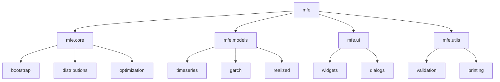
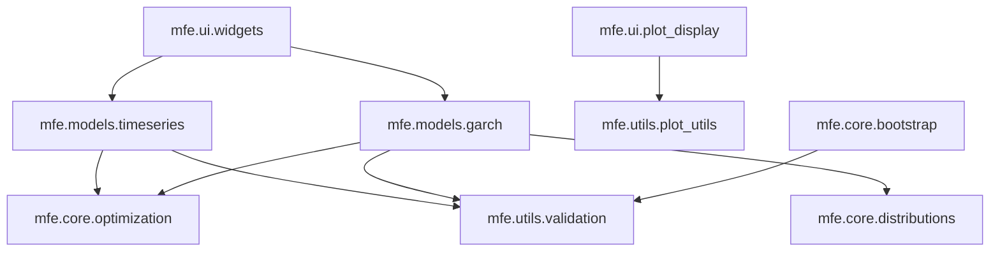

# MFE Toolbox Architecture

## 1. Introduction

### 1.1 Purpose
This document describes the comprehensive architecture of the MFE (MATLAB Financial Econometrics) Toolbox, a Python-based suite of modules designed for financial time series modeling and advanced econometric analyses. It serves as a reference for developers, contributors, and users who need to understand the toolbox's internal structure, component interactions, and design principles.

### 1.2 Scope
This architectural documentation covers the MFE Toolbox version 4.0, a complete reimplementation of the original MATLAB codebase using Python 3.12 and modern programming constructs. It describes the system's package structure, module organization, component interactions, deployment strategy, and performance considerations.

### 1.3 Document Overview
This document is organized as follows:
- Section 1: Introduction and overview
- Section 2: Architectural overview and design principles
- Section 3: Package architecture and module organization
- Section 4: Component interactions and dependencies
- Section 5: Deployment architecture and runtime requirements
- Section 6: Performance considerations and optimizations
- Section 7: Development guidelines
- Section 8: Appendices and references

## 2. Architectural Overview

### 2.1 System Context
The MFE Toolbox operates as a Python package within the Python ecosystem, leveraging the scientific computing stack (NumPy, SciPy, Pandas, Statsmodels) for numerical operations and statistical functions. It provides both programmatic APIs for developers and a PyQt6-based graphical interface for interactive usage.

### 2.2 Python Package Structure
The system architecture follows a modern Python package structure organized into four main namespaces:



### 2.3 Component Model
The MFE Toolbox is designed as a collection of interrelated Python modules organized by functionality:

1. **Core Statistical Modules (`mfe.core`)**: Foundational statistical functionality
   - Bootstrap: Resampling methods for dependent data
   - Distributions: Advanced statistical distributions and testing
   - Optimization: Numba-optimized parameter estimation

2. **Time Series & Volatility Modules (`mfe.models`)**: Econometric modeling components
   - Timeseries: ARMA/ARMAX models with parameter estimation and forecasting
   - GARCH: Univariate and multivariate volatility models
   - Realized: High-frequency volatility estimation

3. **User Interface (`mfe.ui`)**: Interactive modeling environment
   - GUI components built with PyQt6
   - Model configuration panels
   - Diagnostic visualization widgets

4. **Utility Modules (`mfe.utils`)**: Supporting functionality
   - Input validation and error handling
   - Printing and output formatting
   - Common utility functions

### 2.4 Key Design Principles
The architecture embraces the following key design principles:

1. **Python-First Approach**: Leveraging modern Python 3.12 features including:
   - Strict type hints for enhanced code safety
   - Async/await patterns for responsive operations
   - Dataclasses for clean, class-based parameter representation

2. **Performance Optimization**: Critical computational paths accelerated with:
   - Numba JIT compilation for near-native performance
   - NumPy vectorized operations for efficient data processing
   - Asynchronous execution for responsive UI

3. **Modular Design**: Clean separation of concerns through:
   - Namespace-based organization
   - Clear component boundaries
   - Well-defined interfaces between modules

4. **Scientific Stack Integration**: Seamless integration with:
   - NumPy for array operations
   - SciPy for optimization and statistical functions
   - Pandas for time series data handling
   - Statsmodels for econometric modeling foundations

### 2.5 Technology Stack
The MFE Toolbox is built on the following technology stack:

- **Core Language**: Python 3.12
- **Scientific Computing**:
  - NumPy 1.26.3
  - SciPy 1.11.4
  - Pandas 2.1.4
  - Statsmodels 0.14.1
- **Performance Optimization**:
  - Numba 0.59.0
- **User Interface**:
  - PyQt6 6.6.1
- **Development Tools**:
  - Type checking (mypy)
  - Testing (pytest)
  - Documentation (Sphinx)

## 3. Package Architecture

### 3.1 Core Statistical Modules (`mfe.core`)

#### 3.1.1 Bootstrap Module
The bootstrap module implements resampling methods for dependent data, providing tools for robust inference in time series analysis:

```python
# Core interfaces
def block_bootstrap(data, block_size, num_bootstraps):
    """Performs block bootstrap resampling for time series data."""
    # Implementation details...

def stationary_bootstrap(data, expected_block_size, num_bootstraps):
    """Performs stationary bootstrap with random block sizes."""
    # Implementation details...
```

#### 3.1.2 Distributions Module
The distributions module provides implementations of advanced statistical distributions and testing procedures:

```python
# Core interfaces
class GED:
    """Generalized Error Distribution implementation."""
    # Implementation details...

class SkewedT:
    """Hansen's Skewed T distribution implementation."""
    # Implementation details...

def jarque_bera(data):
    """Computes Jarque-Bera test for normality."""
    # Implementation details...
```

#### 3.1.3 Optimization Module
The optimization module provides Numba-optimized numerical optimization routines for parameter estimation:

```python
# Core interfaces
class Optimizer:
    """Asynchronous optimization manager for model estimation."""
    
    async def async_optimize(self, data, initial_params, model_type, distribution):
        """Asynchronously optimize model parameters."""
        # Implementation details...

@numba.jit(nopython=True)
def compute_standard_errors(params, data, model_type_id):
    """Computes parameter standard errors using numerical Hessian."""
    # Implementation details...
```

### 3.2 Time Series & Volatility Modules (`mfe.models`)

#### 3.2.1 Timeseries Module
The timeseries module implements ARMA/ARMAX models with parameter estimation and forecasting:

```python
# Core interfaces
class ARMAX:
    """ARMA/ARMAX model implementation with async estimation."""
    
    async def async_fit(self, data, exog=None):
        """Asynchronously estimate model parameters."""
        # Implementation details...
    
    def forecast(self, steps, exog_future=None):
        """Generate multi-step forecasts."""
        # Implementation details...
    
    def diagnostic_tests(self):
        """Compute model diagnostic statistics."""
        # Implementation details...
```

#### 3.2.2 GARCH Module
The GARCH module provides a unified framework for univariate GARCH models:

```python
# Core interfaces
class GARCHModel:
    """Base class for GARCH model implementations."""
    
    async def async_fit(self, returns):
        """Asynchronously estimate GARCH parameters."""
        # Implementation details...
    
    def forecast(self, horizon):
        """Generate volatility forecasts."""
        # Implementation details...
    
    def simulate(self, n_samples):
        """Simulate returns from the estimated model."""
        # Implementation details...
```

#### 3.2.3 Realized Module
The realized module implements high-frequency volatility estimation methods:

```python
# Core interfaces
def realized_variance(price, time, time_type, sampling_type, sampling_interval):
    """Computes realized variance from high-frequency data."""
    # Implementation details...

def realized_covariance(prices, time, time_type, sampling_type, sampling_interval):
    """Computes realized covariance from multivariate high-frequency data."""
    # Implementation details...
```

### 3.3 User Interface (`mfe.ui`)

#### 3.3.1 Main Window
The main application window coordinates all UI components:

```python
# Core interfaces
class MainWindow(QMainWindow):
    """Main application window for the MFE Toolbox GUI."""
    
    async def on_estimate_clicked(self):
        """Handles model estimation button click asynchronously."""
        # Implementation details...
```

#### 3.3.2 Model Configuration
The model configuration components handle parameter input and validation:

```python
# Core interfaces
class ModelConfig(QWidget):
    """Widget for configuring time series and volatility models."""
    
    def get_config(self):
        """Retrieves current model configuration."""
        # Implementation details...
```

#### 3.3.3 Diagnostic Plots
The diagnostic plots components display statistical visualizations:

```python
# Core interfaces
class DiagnosticPlotsWidget(QWidget):
    """Widget for displaying and managing statistical diagnostic plots."""
    
    async def update_plots(self, residuals, fitted_values):
        """Asynchronously updates all diagnostic plots with new data."""
        # Implementation details...
```

#### 3.3.4 Results Viewer
The results viewer displays model estimation results:

```python
# Core interfaces
class ResultsViewer(QWidget):
    """Interactive viewer for displaying model estimation results."""
    
    def display_parameters(self):
        """Displays parameter estimates and standard errors in table."""
        # Implementation details...
```

### 3.4 Utility Modules (`mfe.utils`)

#### 3.4.1 Validation Module
The validation module provides input validation and parameter checking:

```python
# Core interfaces
def validate_array_input(x, expected_shape=None, dtype=None):
    """Validates NumPy array inputs for numerical computations."""
    # Implementation details...

def validate_parameters(params, bounds=None, param_type=None):
    """Validates model parameters against specified bounds and constraints."""
    # Implementation details...

def validate_model_order(p, q, model_type=None):
    """Validates ARMA/GARCH model orders and ensures they meet requirements."""
    # Implementation details...
```

#### 3.4.2 Printing Module
The printing module handles formatted output and result presentation:

```python
# Core interfaces
def print_results(results, format_type="text"):
    """Formats and prints model estimation results."""
    # Implementation details...

def format_parameters(params, se, t_values, p_values, param_names):
    """Formats parameter estimates with statistics for display."""
    # Implementation details...
```

## 4. Component Interactions

### 4.1 Dependency Diagram
The following diagram illustrates the key dependencies between components:



### 4.2 Data Flow
The typical data flow through the system follows these patterns:

1. **Model Estimation Flow**:
   - User provides time series data and model configuration
   - Input validation ensures data integrity
   - Parameter estimation is performed with Numba-optimized optimization
   - Results are returned to the calling code or UI

2. **Forecasting Flow**:
   - Estimated model parameters are used to generate forecasts
   - Historical data and residuals inform forecast calculations
   - Forecast results are returned for analysis or visualization

3. **Diagnostic Flow**:
   - Model residuals are analyzed to assess fit quality
   - Statistical tests evaluate model assumptions
   - Diagnostic visualizations present results to the user

### 4.3 Communication Patterns
The system uses the following communication patterns:

1. **Direct Function Calls**: Most module interactions occur through direct Python function calls
2. **Asynchronous Operations**: Long-running computations use async/await patterns
3. **Signal-Slot Mechanism**: UI components use PyQt6's signal-slot system for event handling
4. **In-Memory Data Sharing**: Components share data through NumPy arrays and Python objects

### 4.4 API Design
The MFE Toolbox provides several API layers:

1. **Public API**: High-level interfaces for end users
   - Class-based model implementations
   - Estimation, forecasting, and diagnostic functions
   - UI components and interactive tools

2. **Internal API**: Lower-level interfaces for internal use
   - Numba-optimized computation functions
   - Utility and helper functions
   - Implementation details not exposed to end users

## 5. Deployment Architecture

### 5.1 Package Structure
The MFE Toolbox is deployed as a standard Python package with the following structure:

```
mfe/
├── __init__.py
├── core/
│   ├── __init__.py
│   ├── bootstrap.py
│   ├── distributions.py
│   └── optimization.py
├── models/
│   ├── __init__.py
│   ├── armax.py
│   ├── garch.py
│   └── realized.py
├── ui/
│   ├── __init__.py
│   ├── widgets.py
│   ├── dialogs/
│   └── components/
└── utils/
    ├── __init__.py
    ├── validation.py
    └── printing.py
```

### 5.2 Installation Process
The MFE Toolbox is installed using standard Python package management tools:

```bash
# Install from PyPI
pip install mfe-toolbox

# Install from source
git clone https://github.com/username/mfe-toolbox.git
cd mfe-toolbox
pip install -e .
```

### 5.3 Runtime Requirements
The MFE Toolbox has the following runtime requirements:

- Python 3.12 or later
- NumPy 1.26.3 or later
- SciPy 1.11.4 or later
- Pandas 2.1.4 or later
- Statsmodels 0.14.1 or later
- Numba 0.59.0 or later
- PyQt6 6.6.1 or later (for GUI components)

### 5.4 Configuration Management
The MFE Toolbox uses the following configuration approach:

1. **Package Configuration**: Defined in `setup.py` and `pyproject.toml`
2. **Runtime Configuration**: Handled through Python module initialization
3. **User Preferences**: Managed by the UI components for interactive usage

## 6. Performance Considerations

### 6.1 Numba Optimization
Performance-critical operations are optimized using Numba's just-in-time compilation:

```python
@numba.jit(nopython=True)
def compute_garch_likelihood(returns, parameters, model_type_id, distribution_id):
    """Numba-optimized GARCH likelihood calculation."""
    # Implementation details...
```

Key characteristics of the Numba optimization approach:
- JIT compilation for near-native performance
- Type specialization for efficient memory access
- Hardware-specific optimizations through LLVM backend
- Vectorized operations where possible

### 6.2 Memory Management
The system optimizes memory usage through:
- Efficient NumPy array operations
- In-place modifications where appropriate
- Memory-conscious algorithm implementations
- Python's built-in garbage collection

### 6.3 Asynchronous Execution
The system leverages Python's asynchronous programming capabilities:
- Long-running operations are implemented with async/await patterns
- UI responsiveness is maintained during computation
- Progress feedback is provided for extended operations

## 7. Development Guidelines

### 7.1 Coding Standards
Development of the MFE Toolbox follows these coding standards:

1. **Python Style**: PEP 8 coding style with enhancements
2. **Type Annotations**: Comprehensive type hints for all functions and classes
3. **Docstrings**: NumPy-style docstrings for all public interfaces
4. **Exception Handling**: Robust error handling with descriptive messages

### 7.2 Documentation
The MFE Toolbox documentation includes:

1. **API Reference**: Generated from docstrings using Sphinx
2. **User Guide**: Task-oriented instruction for end users
3. **Developer Guide**: Implementation details for contributors
4. **Examples**: Jupyter notebooks demonstrating key functionality

### 7.3 Testing
The MFE Toolbox uses a comprehensive testing approach:

1. **Unit Tests**: Validate individual functions and classes
2. **Integration Tests**: Verify interactions between components
3. **Property Tests**: Statistical property verification using hypothesis
4. **Performance Tests**: Benchmark computation efficiency

## 8. Appendices

### 8.1 Glossary

| Term | Definition |
|------|------------|
| ARMA | Autoregressive Moving Average - time series model combining autoregressive and moving average components |
| ARMAX | ARMA with eXogenous variables - extension of ARMA including external regressors |
| GARCH | Generalized Autoregressive Conditional Heteroskedasticity - model for volatility |
| Numba | Python library that JIT compiles Python functions to optimized machine code |
| PyQt6 | Python bindings for the Qt application framework, used for GUI development |

### 8.2 References
- NumPy Documentation: [https://numpy.org/doc/stable/](https://numpy.org/doc/stable/)
- SciPy Documentation: [https://docs.scipy.org/doc/scipy/](https://docs.scipy.org/doc/scipy/)
- Pandas Documentation: [https://pandas.pydata.org/docs/](https://pandas.pydata.org/docs/)
- Statsmodels Documentation: [https://www.statsmodels.org/stable/index.html](https://www.statsmodels.org/stable/index.html)
- Numba Documentation: [https://numba.pydata.org/numba-doc/latest/index.html](https://numba.pydata.org/numba-doc/latest/index.html)
- PyQt6 Documentation: [https://www.riverbankcomputing.com/static/Docs/PyQt6/](https://www.riverbankcomputing.com/static/Docs/PyQt6/)