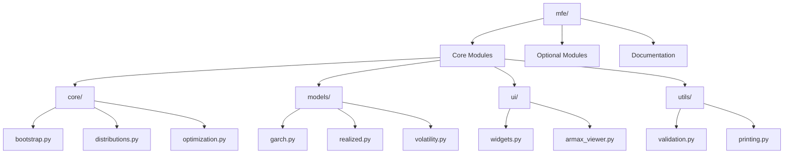

# MFE Toolbox Deployment Guide

This document provides comprehensive deployment instructions for the MFE Toolbox, a Python-based financial econometrics package. It covers package distribution, environment setup, runtime configuration, performance optimization, and platform-specific considerations.

## Package Distribution

The MFE Toolbox is distributed as a Python package via PyPI, making it easy to install across various platforms.

### Package Structure

The MFE Toolbox is organized in a modular structure:



### Distribution Methods

#### PyPI Distribution

The MFE Toolbox is available through PyPI, allowing for simple installation via pip:

```bash
# Install from PyPI
pip install mfe
```

#### Source Distribution

For advanced users or those who need the latest development version:

```bash
# Clone repository
git clone https://github.com/username/mfe-toolbox.git
cd mfe-toolbox

# Install in development mode
pip install -e .
```

### Distribution Package Contents

The distribution package includes:

1. Python source files organized into modules
2. Documentation including user guides and API reference
3. Example scripts and datasets
4. PyProject.toml for build configuration

## Environment Setup

### System Requirements

#### Software Requirements
- Python 3.12 or higher
- pip package manager
- Virtual environment tool (recommended)

#### Hardware Requirements
- Memory: Minimum 50MB
- Disk Space: Minimum 50MB
- Processor: Multi-core CPU recommended for parallel processing

### Dependencies

The MFE Toolbox depends on several Python libraries:

| Library | Version | Purpose |
|---------|---------|---------|
| NumPy | 1.26.3+ | Array operations and numerical computing |
| SciPy | 1.11.4+ | Scientific and statistical functions |
| Pandas | 2.1.4+ | Time series data handling and manipulation |
| Statsmodels | 0.14.1+ | Statistical models and econometric tools |
| Numba | 0.59.0+ | JIT compilation for performance optimization |
| PyQt6 | 6.6.1+ | GUI framework for interactive components |

### Environment Setup Process

#### 1. Create a Virtual Environment (Recommended)

```bash
# Create a new virtual environment
python -m venv mfe-env

# Activate the virtual environment
# On Windows
mfe-env\Scripts\activate
# On Unix or macOS
source mfe-env/bin/activate
```

#### 2. Install the MFE Toolbox

```bash
# Install core package
pip install mfe

# Or, for development version
pip install -e .
```

#### 3. Verify Installation

```python
import mfe
print(mfe.__version__)
```

## Runtime Configuration

### Python Runtime Environment

The MFE Toolbox requires Python 3.12 or higher and leverages modern Python features including:
- Asynchronous programming with async/await
- Type hints for improved code robustness
- Dataclasses for efficient model parameter representation

### Configuration Settings

Environment variables that control MFE Toolbox behavior:

#### Numba Configuration

```bash
# Set number of threads for parallel execution
export NUMBA_NUM_THREADS=8  # Set to number of CPU cores

# Choose threading implementation
export NUMBA_THREADING_LAYER=tbb  # Options: tbb, omp, workqueue

# Control JIT compilation
export NUMBA_CACHE_DIR=/path/to/cache  # Custom cache directory
```

#### Debug Configuration

```bash
# Enable debug output
export NUMBA_DEBUG=1

# Detailed optimization info
export NUMBA_DEBUG_ARRAY_OPT=1

# Disable JIT (for testing)
export NUMBA_DISABLE_JIT=0  # Set to 1 to disable
```

### Initialization Sequence

The MFE Toolbox initialization follows this sequence:

1. Python module import
2. Package path configuration
3. Environment validation
4. Numba optimization preparation
5. Ready for computation

### Deployment Modes

The MFE Toolbox supports multiple deployment modes:

1. **Interactive Mode**: For exploratory analysis and research
2. **Batch Processing Mode**: For automated analysis pipelines
3. **GUI Mode**: For interactive modeling with visual interface

## Performance Optimization

### Numba Optimization

The MFE Toolbox leverages Numba's just-in-time (JIT) compilation to achieve near-native performance:

```python
from numba import jit
import numpy as np

@jit(nopython=True)
def optimize_garch(params, data):
    # Numba-optimized GARCH implementation
    # This runs with near-C performance
    return results
```

Key Numba optimization features:

1. **@jit Decorator**: Automatically compiles Python functions to optimized machine code
2. **nopython Mode**: Ensures maximum performance by avoiding Python API calls
3. **Parallel Execution**: Enables multi-threading for suitable algorithms
4. **Hardware Optimization**: Leverages CPU-specific instruction sets

### Performance Best Practices

For optimal performance with the MFE Toolbox:

1. Use NumPy arrays for all numerical inputs
2. Leverage vectorized operations where possible
3. Use asynchronous API for long-running computations
4. Verify Numba JIT compilation with appropriate logging

### Memory Management

Efficient memory usage strategies:

1. Use in-place operations when possible
2. Release large arrays when no longer needed
3. Use appropriate data types (e.g., float32 vs float64)
4. Monitor memory usage during large calculations

## Platform Support

The MFE Toolbox is designed to work across multiple platforms:

### Windows

- Compatible with Windows 10/11
- Requires Python 3.12+ from python.org or Microsoft Store
- Numba requires Microsoft Visual C++ Build Tools

Installation notes:
```bash
# Windows-specific installation
python -m pip install mfe
```

### macOS

- Compatible with macOS 10.15+
- Supports both Intel and Apple Silicon (M1/M2)
- Requires XCode Command Line Tools for Numba compilation

Installation notes:
```bash
# macOS-specific installation
python3 -m pip install mfe
```

### Linux

- Compatible with major distributions (Ubuntu, Fedora, etc.)
- Requires development packages for compilation
- GUI requires X11 or Wayland with Qt dependencies

Installation notes:
```bash
# Linux-specific dependencies (Ubuntu example)
sudo apt-get update
sudo apt-get install python3-dev build-essential
python3 -m pip install mfe
```

## Deployment Checklist

Before deploying the MFE Toolbox in a production environment, ensure you've completed the following:

### Pre-Deployment

- [ ] Verify Python 3.12+ is installed
- [ ] Confirm all dependencies are installed and at correct versions
- [ ] Create and activate a dedicated virtual environment
- [ ] Install MFE Toolbox from PyPI or source
- [ ] Run verification tests to ensure correct installation

### Configuration

- [ ] Set appropriate Numba environment variables for your hardware
- [ ] Configure threading levels based on available CPU cores
- [ ] Set up appropriate logging configuration
- [ ] Verify GUI components work if needed

### Testing

- [ ] Run basic import test to verify package loading
- [ ] Confirm Numba JIT compilation works correctly
- [ ] Test core functionality with sample data
- [ ] Verify memory usage is within expected parameters

### Production Deployment

- [ ] Document deployment configuration
- [ ] Create backup/rollback plan
- [ ] Set up monitoring for performance/issues
- [ ] Schedule regular updates from PyPI

## Troubleshooting

### Common Issues

#### ImportError: No module named 'numba'
- Ensure Numba is installed: `pip install numba`
- Verify Python version compatibility

#### Performance Issues
- Check Numba JIT compilation status
- Verify hardware compatibility
- Monitor resource usage

#### Installation Errors
- Update pip: `pip install --upgrade pip`
- Check Python version compatibility
- Verify system requirements

### Getting Help

- Check documentation
- Submit issue on GitHub
- Contact support team

## Additional Resources

- [MFE Toolbox Documentation](https://mfe-toolbox.readthedocs.io/)
- [Python Packaging User Guide](https://packaging.python.org/)
- [Numba Documentation](https://numba.pydata.org/)
- [NumPy Documentation](https://numpy.org/doc/)