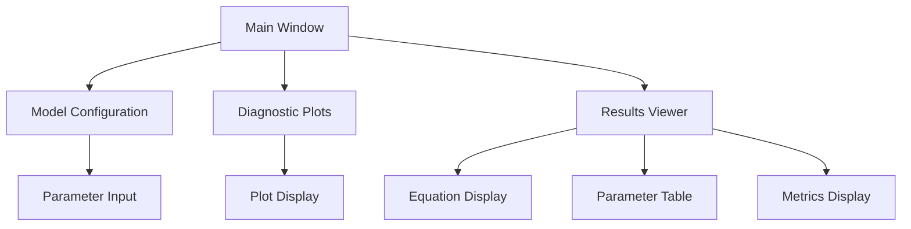
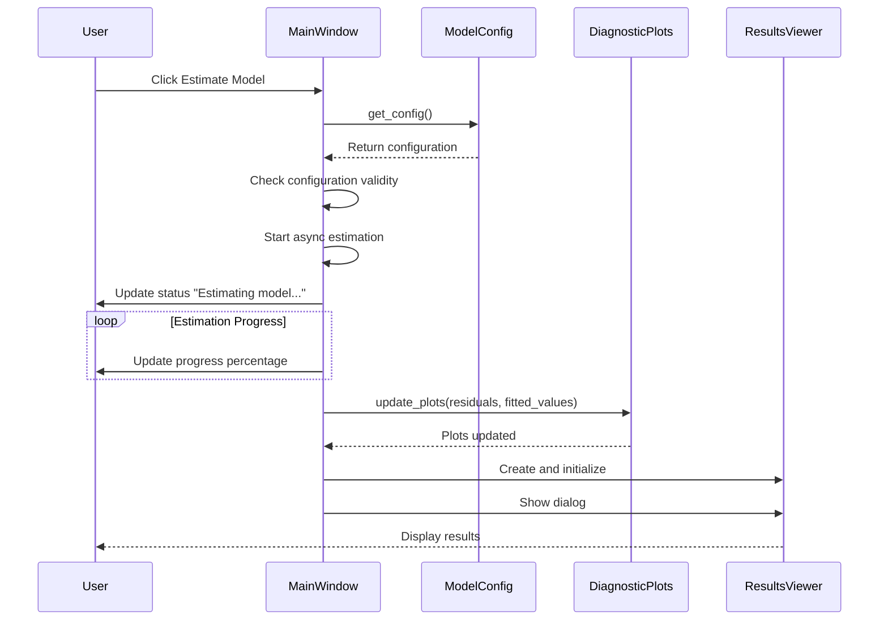
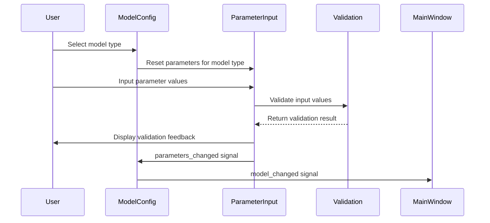
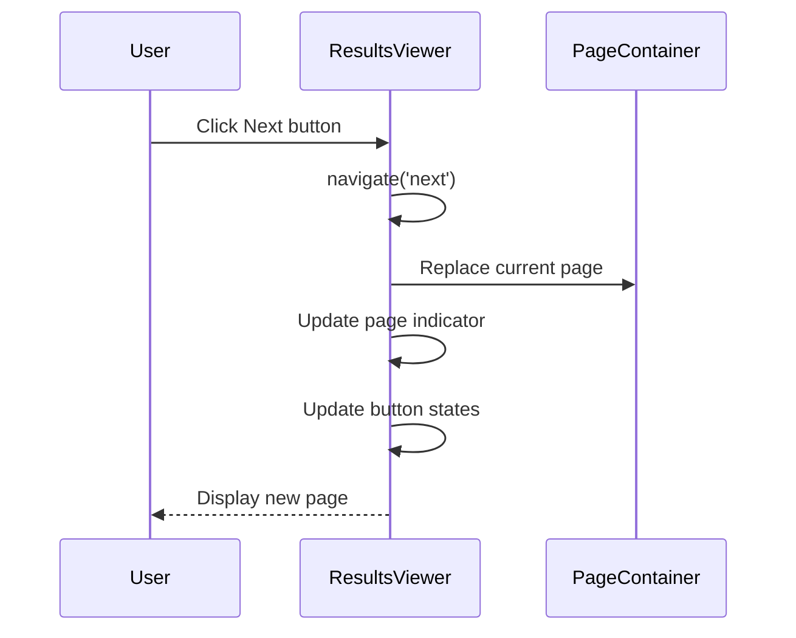

# MFE Toolbox GUI Documentation

## 1. Introduction

### 1.1 Overview
This document provides comprehensive guidance on the PyQt6-based graphical user interface of the MFE Toolbox. The GUI allows users to interact with the econometric modeling system through an intuitive interface that supports model configuration, estimation, diagnostic analysis, and results visualization.

### 1.2 Architecture
The GUI is built using PyQt6 and follows a modular component-based architecture:



### 1.3 Key Features
- Interactive model configuration with real-time validation
- Asynchronous model estimation for responsive UI
- Interactive diagnostic plots for model assessment
- Comprehensive results viewing with parameter statistics
- Theme-aware styling for consistent visual appearance
- Cross-platform compatibility through PyQt6

## 2. Main Application Window

### 2.1 Layout Structure
The main application window is organized into the following sections:

```
+----------------------------------------------------------+
|  ARMAX Model Estimation                               [x]  |
+----------------------------------------------------------+
|  File   Help                                              |
+----------------------------------------------------------+
|                                                           |
| Model Configuration                                       |
| +------------------------------------------------------+ |
| | AR Order:  [...] [?]                                 | |
| | MA Order:  [...] [?]                                 | |
| | Include Constant: [ ]                                | |
| | Exogenous Variables: [v]                             | |
| +------------------------------------------------------+ |
|                                                           |
| Diagnostic Plots                                          |
| +----------------------+  +---------------------------+   |
| |                      |  |                           |   |
| |     Residuals        |  |          ACF              |   |
| |                      |  |                           |   |
| +----------------------+  +---------------------------+   |
| +----------------------+  +---------------------------+   |
| |                      |  |                           |   |
| |      PACF            |  |     Statistical Tests     |   |
| |                      |  |                           |   |
| +----------------------+  +---------------------------+   |
|                                                           |
| [Estimate Model]  [Reset]  [View Results]  [Close]       |
+----------------------------------------------------------+
|  Ready                                                    |
+----------------------------------------------------------+
```

### 2.2 Components
The main window consists of the following components:

#### 2.2.1 Menu Bar
- File menu: New, Open, Save, Exit options
- Help menu: About option

#### 2.2.2 Model Configuration Section
- AR/MA order inputs with validation
- Constant term option
- Exogenous variables selection

#### 2.2.3 Diagnostic Plots Section
- Tabbed plot display with residuals, ACF, and diagnostics
- Interactive zoom and pan capabilities
- Auto-updating based on model estimation

#### 2.2.4 Action Buttons
- Estimate Model: Starts the model estimation process
- Reset: Clears all inputs and plots
- View Results: Opens the results viewer dialog
- Close: Exits the application with confirmation

#### 2.2.5 Status Bar
- Displays application status and messages
- Shows progress during model estimation

### 2.3 Implementation Details

#### 2.3.1 MainWindow Class
```python
class MainWindow(QMainWindow):
    """Main application window for the MFE Toolbox GUI"""
    
    def __init__(self, parent=None):
        # Initialize the main window
        
    def setup_ui(self):
        # Create and arrange UI components
        
    def setup_menu_bar(self):
        # Configure the menu bar
        
    async def on_estimate_clicked(self):
        # Handle model estimation asynchronously
        
    def on_reset_clicked(self):
        # Handle reset button click
        
    def _show_results(self):
        # Show the results viewer dialog
        
    def closeEvent(self, event):
        # Handle window close event with confirmation
```

#### 2.3.2 Signal-Slot Connections
- estimate_button.clicked.connect(self._on_estimate_button_clicked)
- reset_button.clicked.connect(self.on_reset_clicked)
- view_results_button.clicked.connect(self._show_results)
- close_button.clicked.connect(self.close)

#### 2.3.3 Asynchronous Estimation
```python
def _on_estimate_button_clicked(self):
    """Handles the estimate button click by starting an async task"""
    # Create an async task to handle the estimation
    asyncio.create_task(self.on_estimate_clicked())

async def on_estimate_clicked(self):
    """Handles model estimation button click asynchronously"""
    try:
        # Get model configuration
        config = self._model_config.get_config()
        
        # Update status bar
        self._status_bar.showMessage("Estimating model...")
        
        # Perform estimation asynchronously
        # Update progress in status bar
        
        # Update plots with results
        await self._diagnostic_plots.update_plots(residuals, fitted_values)
        
        # Create results viewer
        # Show results
    except Exception as e:
        # Handle errors
```

## 3. Results Viewer

### 3.1 Layout Structure
The results viewer displays the model estimation results in a tabbed interface:

```
+----------------------------------------------------------+
|  ARMAX Model Results                                 [x]  |
+----------------------------------------------------------+
|                                                           |
| Model Equation                                            |
| +------------------------------------------------------+ |
| |  y(t) = 0.7 * y(t-1) - 0.3 * ε(t-1) + 0.002          | |
| +------------------------------------------------------+ |
|                                                           |
| Parameter Estimates                                       |
| +------------------------------------------------------+ |
| | Parameter  | Estimate | Std.Error | t-stat | p-value | |
| |-----------|----------|------------|---------|--------| |
| | AR(1)     | [0.756]  | [0.045]   | [16.8]  | [0.00] | |
| | MA(1)     | [-0.243] | [0.067]   | [-3.6]  | [0.00] | |
| | Constant  | [0.002]  | [0.001]   | [2.0]   | [0.04] | |
| +------------------------------------------------------+ |
|                                                           |
| Statistical Metrics                                       |
| +----------------------+  +---------------------------+   |
| | Log-Likelihood      |  | Information Criteria      |   |
| | [-245.67]           |  | AIC: [-2.34]             |   |
| |                     |  | BIC: [-2.28]             |   |
| +----------------------+  +---------------------------+   |
|                                                           |
| [Previous] [1/2] [Next]                [Close]            |
+----------------------------------------------------------+
```

### 3.2 Components
The results viewer consists of the following components:

#### 3.2.1 Model Equation Display
- Shows the estimated model equation with parameters
- Uses HTML formatting for subscripts and symbols

#### 3.2.2 Parameter Estimates Table
- Displays parameter names, estimates, standard errors, t-statistics, and p-values
- Highlights significant parameters

#### 3.2.3 Statistical Metrics
- Shows model fit statistics (log-likelihood, AIC, BIC)
- Displays diagnostic test results

#### 3.2.4 Diagnostic Plots
- Comprehensive diagnostic plots for model evaluation
- Multiple visualizations on a separate tab

#### 3.2.5 Navigation Controls
- Page navigation between parameters/metrics and plots
- Close button to dismiss the dialog

### 3.3 Implementation Details

#### 3.3.1 ResultsViewer Class
```python
class ResultsViewer(QWidget):
    """Interactive viewer for displaying ARMAX model estimation results"""
    
    def __init__(self, model, parent=None):
        # Initialize the results viewer
        
    def _create_ui(self):
        # Create and arrange UI components
        
    def display_equation(self):
        # Display the model equation with estimated parameters
        
    def display_parameters(self):
        # Display parameter estimates and standard errors
        
    def display_metrics(self):
        # Display model fit metrics and diagnostics
        
    def display_plots(self):
        # Display diagnostic plots
        
    def navigate(self, direction):
        # Handle navigation between pages
```

#### 3.3.2 Signal-Slot Connections
- self._prev_button.clicked.connect(lambda: self.navigate('prev'))
- self._next_button.clicked.connect(lambda: self.navigate('next'))

## 4. Component Documentation

### 4.1 ModelConfig Component
The ModelConfig component provides the interface for configuring model parameters.

#### 4.1.1 Features
- Model type selection
- Parameter input fields with validation
- Real-time error feedback
- Default parameter suggestions

#### 4.1.2 Signals
- model_changed: Emitted when model configuration changes
- config_error: Emitted when configuration has errors

#### 4.1.3 Usage Example
```python
# Create model configuration widget
model_config = ModelConfig(self)
layout.addWidget(model_config)

# Connect to model changed signal
model_config.model_changed.connect(self._on_model_changed)
```

### 4.2 DiagnosticPlotsWidget Component
The DiagnosticPlotsWidget provides visualizations for model diagnostics.

#### 4.2.1 Features
- Tabbed interface for different plot types
- Asynchronous plot updates
- Interactive zoom and pan
- Theme-aware styling

#### 4.2.2 Methods
- async update_plots(residuals, fitted_values): Updates all plots with new data
- clear_plots(): Clears all plots
- switch_to_tab(tab_name): Switches to a specific tab

#### 4.2.3 Usage Example
```python
# Create diagnostic plots widget
diagnostic_plots = DiagnosticPlotsWidget(self)
layout.addWidget(diagnostic_plots)

# Update plots with data
asyncio.create_task(diagnostic_plots.update_plots(residuals, fitted_values))
```

### 4.3 PlotDisplay Component
The PlotDisplay component provides a container for Matplotlib plots.

#### 4.3.1 Features
- Theme-aware plot styling
- Interactive navigation toolbar
- Asynchronous plot updates
- Efficient memory management

#### 4.3.2 Methods
- async display_residual_plot(residuals, fitted_values): Shows residual analysis
- async display_acf_plot(data): Shows autocorrelation function
- async display_diagnostic_plots(residuals, fitted_values): Shows comprehensive diagnostics
- clear_plots(): Clears all plots

#### 4.3.3 Usage Example
```python
# Create plot display
plot_display = PlotDisplay(self)
layout.addWidget(plot_display)

# Display ACF plot
asyncio.create_task(plot_display.display_acf_plot(residuals))
```

## 5. Interaction Flows

### 5.1 Model Estimation Flow



### 5.2 Parameter Configuration Flow



### 5.3 Results Navigation Flow



## 6. Implementation Patterns

### 6.1 Asynchronous Operations
The GUI uses Python's async/await pattern for long-running operations:

```python
# Button click handler that starts async operation
def _on_estimate_button_clicked(self):
    asyncio.create_task(self.on_estimate_clicked())

# Async method for model estimation
async def on_estimate_clicked(self):
    try:
        # Long-running operation
        for progress in range(1, 11):
            await asyncio.sleep(0.2)  # Simulate computation time
            self._status_bar.showMessage(f"Estimating model... {progress * 10}%")
            
        # Update plots asynchronously
        await self._diagnostic_plots.update_plots(residuals, fitted_values)
    except Exception as e:
        # Handle errors
```

### 6.2 Signal-Slot Connections
PyQt6's signal-slot mechanism is used for event handling:

```python
# Connect button signals
estimate_button.clicked.connect(self._on_estimate_button_clicked)
reset_button.clicked.connect(self.on_reset_clicked)

# Connect model configuration signals
self._model_config.model_changed.connect(self._on_model_changed)

# Define slot method
def _on_model_changed(self, config):
    self._has_unsaved_changes = True
    
    # Update status message based on config validity
    if config.get('is_valid', False):
        self._status_bar.showMessage("Model configuration updated")
    else:
        self._status_bar.showMessage("Warning: Current model configuration is invalid")
```

### 6.3 Widget Creation Helper
The GUI uses a helper function for consistent widget creation:

```python
# Create a widget with consistent styling
def create_widget(widget_type, properties):
    # Import the widget class
    module = importlib.import_module('PyQt6.QtWidgets')
    widget_class = getattr(module, widget_type)
    
    # Create widget instance
    widget = widget_class()
    
    # Apply properties
    for prop_name, prop_value in properties.items():
        if hasattr(widget, f"set{prop_name[0].upper()}{prop_name[1:]}"):
            setter = getattr(widget, f"set{prop_name[0].upper()}{prop_name[1:]}")
            setter(prop_value)
        else:
            widget.setProperty(prop_name, prop_value)
    
    return widget

# Usage example
label = create_widget("QLabel", {
    "text": "Parameter:",
    "alignment": Qt.AlignmentFlag.AlignRight
})
```

### 6.4 Input Validation
The GUI implements real-time input validation:

```python
def validate_widget_input(widget, validation_rules):
    # Get widget type for dispatching to appropriate validator
    widget_type = widget.__class__.__name__
    
    # Validate based on widget type
    if widget_type == 'QLineEdit':
        return validate_line_edit(widget, validation_rules)
    elif widget_type == 'QSpinBox':
        return validate_spin_box(widget, validation_rules)
    # ...
    
    return True  # Default to valid
```

## 7. Theme and Styling

### 7.1 Theme System
The GUI implements a theme system for consistent styling:

```python
def initialize_theme(theme_name="light"):
    # Get application instance
    app = QApplication.instance()
    
    # Create color palette for theme
    palette = create_theme_palette(theme_name)
    
    # Set application-wide palette
    app.setPalette(palette)
    
    # Load and apply stylesheet
    stylesheet_path = f"src/web/assets/styles/{theme_name}.qss"
    with open(stylesheet_path, 'r') as file:
        app.setStyleSheet(file.read())
    
    # Configure default fonts
    app.setFont(get_default_font())
```

### 7.2 Plot Styling
Matplotlib plots are styled to match the UI theme:

```python
def configure_plot_style(figure, theme_name='default'):
    # Define theme parameters
    if theme_name == 'dark':
        # Dark theme parameters
        bg_color = '#2D2D2D'
        text_color = '#E0E0E0'
        grid_color = '#404040'
        face_color = '#3D3D3D'
    else:
        # Light/default theme parameters
        bg_color = '#FFFFFF'
        text_color = '#333333'
        grid_color = '#E5E5E5'
        face_color = '#F9F9F9'
    
    # Apply theme to figure and axes
    figure.patch.set_facecolor(bg_color)
    
    for ax in figure.get_axes():
        ax.set_facecolor(face_color)
        
        # Set text colors
        ax.title.set_color(text_color)
        ax.xaxis.label.set_color(text_color)
        ax.yaxis.label.set_color(text_color)
        
        # Set tick colors
        ax.tick_params(axis='x', colors=text_color)
        ax.tick_params(axis='y', colors=text_color)
```

## 8. Best Practices

### 8.1 Component Naming Conventions
- Prefix class members with underscore (e.g., `self._parameter_table`)
- Use descriptive naming for components (e.g., `model_config` instead of `config`)
- Use standard prefixes for Qt widgets (e.g., `self._ok_button`)

### 8.2 Layout Design Guidelines
- Use nested layouts for complex UIs
- Set appropriate spacing and margins
- Provide reasonable minimum sizes
- Use stretch factors for responsive resizing

### 8.3 Error Handling
- Always wrap long-running operations in try/except blocks
- Log errors with appropriate severity
- Provide user-friendly error messages
- Use the status bar for error notifications

### 8.4 Performance Considerations
- Use async/await for long-running operations
- Update the UI in small increments
- Use Numba for performance-critical computation
- Properly manage plot resources

### 8.5 Accessibility Guidelines
- Provide tooltips for all interactive elements
- Use tab orders that follow logical flow
- Ensure sufficient color contrast
- Use accessible names for screen readers